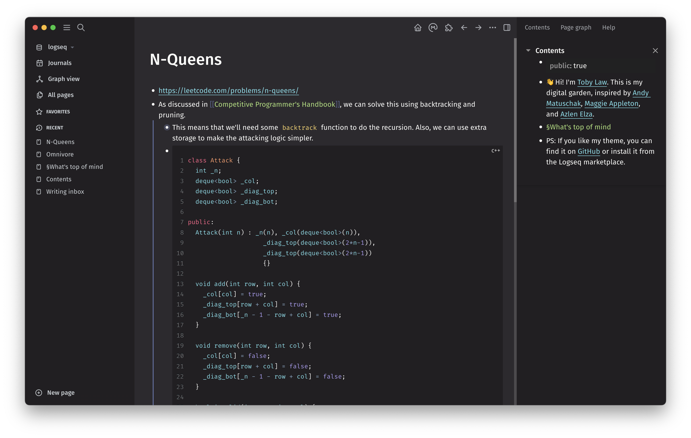

# Monokai for [Logseq](http://logseq.com)

> A dark theme for [Logseq](http://logseq.com) inspired by [Monokai](https://monokai.pro/) and [Dracula](https://draculatheme.com/).

> \[!NOTE\]
> Choosing an account colour will override parts of this theme.



## Install

You can install this theme from the Logseq marketplace.

If you prefer, you can also get this theme by:

- Paste this line to your `logseq/custom.css` file:
- `@import url('https://cdn.jsdelivr.net/gh/tzcl/logseq-monokai@main/custom.css');`

OR

- Paste this line to your `logseq/config.edn` file:
- `:custom-css-url "@import url('https://cdn.jsdelivr.net/gh/tzcl/logseq-monokai@main/custom.css');"`

OR

- Copy the contents of `custom.css` into your `logseq/custom.css` file.

## Customising

To customise the theme, use Developer Tools within Logseq to identify the components you want to style and add the relevant CSS to your `logseq/custom.css` file.

Here are some custom snippets you might find useful:
```css
/* Enhance a persistent highlighted text color for italic or/and bold */
html[data-theme="dark"] .inline mark i b, 
html[data-theme="dark"] .inline mark i, 
html[data-theme="dark"] .inline mark b {
  color: var(--ls-page-mark-color);
}
```
```css
/* Add roundish checkbox corners */
html[data-theme="dark"] [type="checkbox"] {
  border-radius: 0.2rem;
}
```
```css
/* Utilize green color for active tasks such as DOING and NOW */
html[data-theme="dark"] .inline .doing a,
html[data-theme="dark"] .inline .now a {
  color: var(--green);
}
```
## Publishing

To publish a new version of this theme, click "Draft a new release" under the Releases tab.

## License

[MIT License](./LICENSE)
